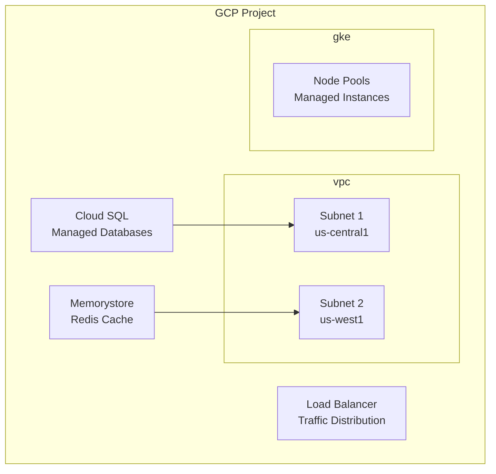
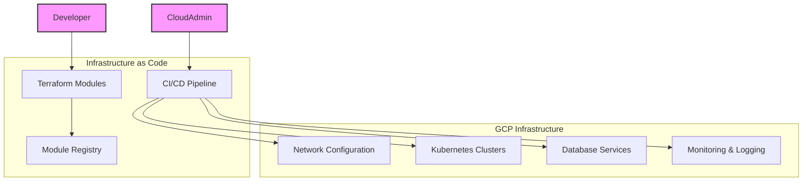
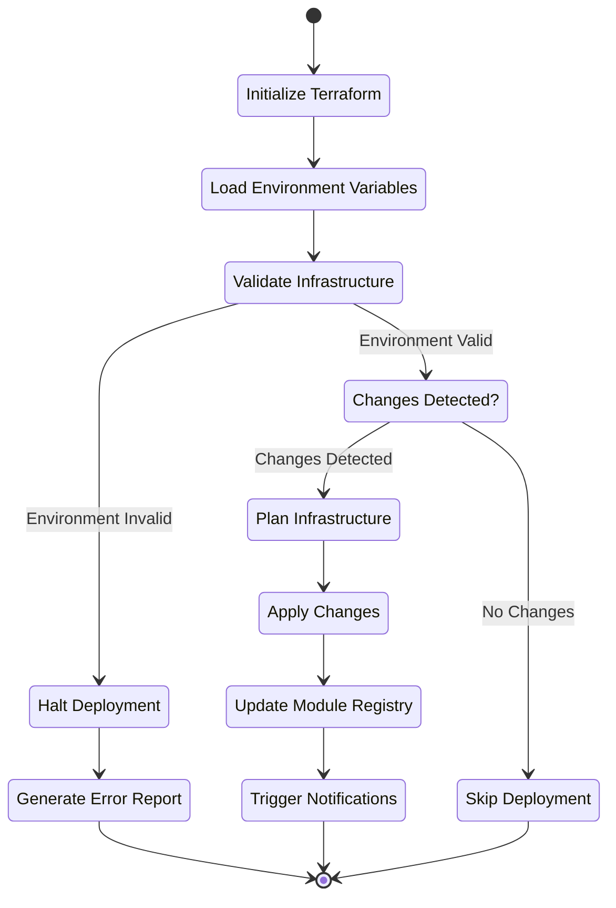
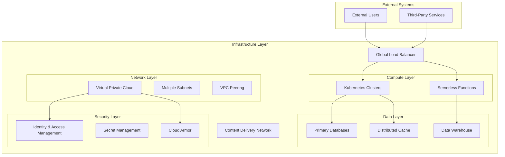
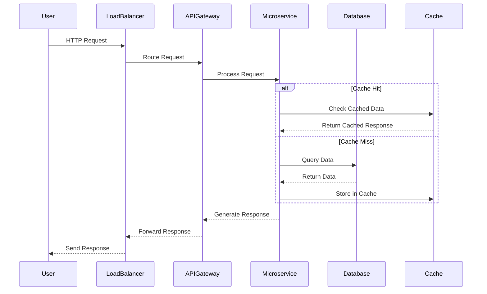

# Terraform Monorepo for GCP Infrastructure

## 🚀 Project Overview

This monorepo provides a comprehensive, scalable, and modular Terraform infrastructure setup for Google Cloud Platform (GCP) microservices architectures.

## Project Badges

### Status Badges


### Community Badges


### Key Features

- 🌐 Multi-environment support (dev, staging, production)
- 🔒 Security-first approach
- 📦 Modular infrastructure design
- 🤖 Automated documentation and versioning
- 🔄 Continuous integration and deployment

## 🏗 Architecture Overview

### High-Level Infrastructure Architecture



### Detailed Component Diagram



### Infrasturcture Flow Diagram



### Architecture Context Diagram



### Service Interaction Diagram



## 📂 Repository Structure

```text
gcp-microservices-infra/
 ├── .github/       # CI/CD workflow configurations 
 ├── modules/       # Reusable Terraform modules
 │   ├── network/
 │   ├── kubernetes/
 │   └── databases/
 ├── environments/  # Environment-specific configurations 
 ├── services/      # Service-level infrastructure 
 ├── scripts/       # Utility and automation scripts
 │   ├── module-publish.sh
 │   └── module-validate.sh
 ├── module-registry/
 │   ├── network/
 │   │   ├── README.md
 │   │   └── versions.json
 │   │
 │   ├── kubernetes/
 │   │   ├── README.md
 │   │   └── versions.json
 │   │
 │   └── databases/
 │       ├── README.md
 │       └── versions.json
 └── MODULE_VERSIONING.md
```

## 🛠 Prerequisites

- Terraform 1.5+
- Google Cloud SDK
- GitHub Account
- Python 3.9+

## 🔧 Module Versioning Strategy

### Semantic Versioning

We follow semantic versioning for infrastructure modules:

- `v1.x.x`: Initial implementation
- `v2.x.x`: Enhanced features
- `v3.x.x`: Major architectural changes

### Versioning Workflow

1. Create new version directory
2. Update module implementation
3. Run validation scripts
4. Update `versions.json`
5. Tag and publish

## 📋 Module Types

### Network Modules

- VPC configurations
- Subnet management
- Firewall rules
- DNS settings

### Kubernetes Modules

- GKE cluster creation
- Node pool management
- Workload identity
- Cluster addons

### Database Modules

- Cloud SQL configurations
- Memorystore setup
- Database security

### Observability Modules

- Logging configurations
- Monitoring dashboards
- Alerting mechanisms

## 🚀 Getting Started

### 1. Clone the Repository

```bash
git clone https://github.com/your-org/gcp-microservices-infra.git
cd gcp-microservices-infra
```

### 2. Initialize GCP Project

```bash
# Set GCP Project
gcloud config set project YOUR_PROJECT_ID

# Authenticate
gcloud auth application-default login
```

### 3. Configure Terraform Backend
Create a GCS bucket for Terraform state:

```bash
gsutil mb gs://your-terraform-state-bucket
```

### 4. Select Environment

```bash
# Navigate to environment
cd environments/dev/us-central1

# Initialize Terraform
terraform init

# Plan infrastructure
terraform plan
```

## 🤖 Automated Workflows

### README Generation

Automatically generate module documentation:

```bash
python scripts/generate_readme.py modules/network/v2
```

### Module Versioning

Publish a new module version:

```bash
./scripts/module-publish.sh modules/network v2.0.0
```

## 🔒 Security Practices

- Least privilege IAM roles
- Workload identity for GKE
- Encrypted state management
- Network isolation
- Secret management with Google Secret Manager

## 📊 Monitoring & Observability

- Integrated logging
- Prometheus metrics
- Cloud Monitoring dashboards
- Centralized log sinks
  
## 🧪 Testing

### Static Analysis

```bash
# Run tflint
tflint

# Run terrascan
terrascan scan
```

### Integration Testing

```bash

# Validate module configurations
terraform validate

# Dry-run infrastructure changes
terraform plan
```

## 🤝 Contributing

- Fork the repository
- Create a feature branch
- Commit your changes
- Push to the branch
- Create a Pull Request

## Contribution Guidelines

- Follow module versioning strategy
- Add comprehensive documentation
- Include example usage
- Write unit tests
- Update changelog

## 📝 Changelog Management

We use conventional commit messages:

- **feat**: New features
- **fix**: Bug fixes
- **docs**: Documentation updates
- **refactor**: Code refactoring
- **test**: Adding tests

## 📄 Licensing

This project is licensed under the MIT License.

## 🌟 Support

- Open an issue for bug reports
- Discuss features in discussions
- Contact maintainers for support

## 🔗 Related Resources

- [Terraform Documentation](https://www.terraform.io/docs)
- [Google Cloud Documentation](https://cloud.google.com/docs)
- [Terraform GCP Provider](https://registry.terraform.io/providers/hashicorp/google/latest/docs)

## Maintained by My Organization

Terraform GCP

### Key Sections Included:
1. Project Overview
2. Repository Structure
3. Prerequisites
4. Versioning Strategy
5. Module Types
6. Getting Started Guide
7. Automated Workflows
8. Security Practices
9. Testing Approaches
10. Contributing Guidelines
11. Changelog Management
12. Support and Resources

### Recommended Enhancements:
- Add badges
- Include architecture diagrams
- Create separate documentation site
- Add more detailed examples
- Include troubleshooting section